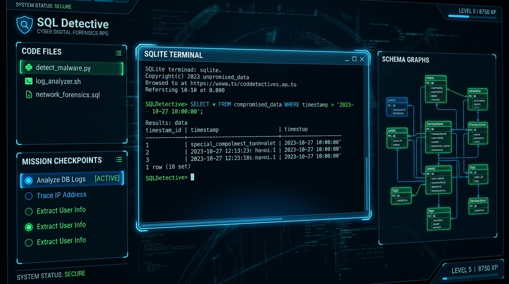
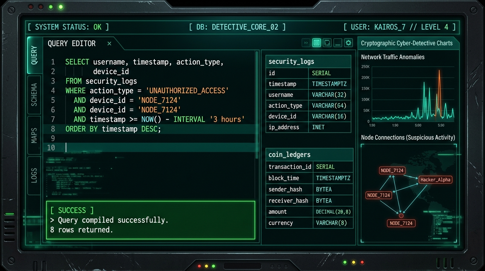

# 🕵️‍♂️ SQL Detective — Cyber Digital Forensics RPG

SQL Detective is an educational, highly immersive, browser-based role-playing game designed to teach SQL by casting players as cyber-forensics investigators. Players analyze compromised mainframe backups, trace suspicious crypto transactions, and stop coordinated network intrusions by composing actual SQL queries against sandboxed databases in real time.

Developed with a high-contrast, modern cyber-detective theme, the app pairs gamified progression with a fully sandboxed in-memory SQLite runtime.

---

## 📸 Application Previews

| **DFA Digital Forensics HQ Landing** | **SQLite Forensic Terminal & Workspace** |
| :---: | :---: |
|  |  |

---

## 🚀 Live Demo & Preview
- **Development App**: [Live Link](https://ais-dev-52hbabf3n7fhucibry4f2k-581922904842.asia-southeast1.run.app)
- **Shared App URL**: [Live Link](https://ais-pre-52hbabf3n7fhucibry4f2k-581922904842.asia-southeast1.run.app)

---

## ✨ Features

### 📖 Immersive Cyber Detective Storyline
- Step into the shoes of a **Special Analyst at the Digital Forensics Agency (DFA)**.
- Analyze real security incident datasets to filter innocent employee records from malicious intruder footprints.

### 💻 Real In-Memory SQLite Sandbox
- Run **actual raw SQL queries** right inside your browser. No mock outputs, no fake simulated queries — your inputs are run against a sandboxed in-memory SQLite database!
- Includes an interactive **Database Schema Explorer**. Click table names or columns to automatically inject them into your SQL editor cursor.

### 🗺️ Progressive Learning Roadmap (DFA Academy Syllabus)
- **Chapter 1: Database Breaches (SELECT, WHERE, LIKE, LIMIT, ORDER BY)**: Learn the fundamentals of filtering rows, searching patterns, and sorting logs.
- **Chapter 2: Shadow Traces (GROUP BY, HAVING, COUNT, SUM, AVG)**: Aggregate log patterns, find server load anomalies, and group system events.
- **Chapter 3: Financial Forensics (INNER JOIN, LEFT JOIN, ON, USING)**: Map coin wallet transfers and reconstruct missing system ledger histories.

### 🏆 Gamified Progression & Academy Store
- **Operative Dossiers**: Level up your custom investigator profile, earn Experience Points (XP), and unlock higher security titles.
- **Evidence Points (EP) Hint Loop**: Deduct earned EP to buy multi-layered contextual hints (Table clues, Column clues, and Query Syntax helpers).
- **DFA Academy Store**: Accumulate ledger credits from solving cases and spend them to buy rare avatar badges to decorate your dossier.
- **Achievements & Streaks**: Keep your investigation streak alive and unlock commemorative medals for exceptional efficiency.

### 🔒 Firebase Auth & Cloud Firestore Persistence
- **No-Gate Landing Page**: Visitors can explore the briefing, review syllabus roadmaps, and interact with the live query editor demo without forcing registration up-front.
- **Secure Synchronization**: Instantly log in or register via email to auto-save and sync operative progress, unlocked credits, and custom avatars across sessions.

---

## 🛠️ Architecture & Tech Stack

### Frontend & Core
- **React 18** + **Vite** (TypeScript template)
- **Tailwind CSS** for custom cyber-themed utility styling
- **Motion** (`motion/react`) for smooth dashboard state transitions and modal triggers
- **Lucide React** for uniform UI icons

### Persistence & Storage
- **In-Memory SQLite** via `@sqlite.org/sqlite-wasm` / Client-Side DB Managers
- **Firebase Firestore** for durable cloud synchronization of operative stats, purchase logs, completed levels, and profile settings
- **Firebase Authentication** for user profile mapping

---

## 📂 Project Structure

```text
├── src/
│   ├── components/            # Interactive UI views and modals
│   │   ├── LandingPage.tsx    # Cyber-themed bento-grid landing page
│   │   ├── AuthScreen.tsx     # Terminal styled Firebase log in/register
│   │   ├── MainMenu.tsx       # HQ Operative central command station
│   │   ├── GameScreen.tsx     # Code Editor, Schema Explorer, Hints panel
│   │   ├── ProfileView.tsx    # Academy badge shop and dossier customizer
│   │   └── SchemaExplorer.tsx # Interactive database catalog inspector
│   ├── database/              # SQLite connectors & Firestore endpoints
│   ├── hooks/                 # Game loop state machines
│   │   └── useGameState.ts    # Central hook handling XP, levels, and purchases
│   ├── levels/                # Chapter syllabuses & SQLite schemas
│   │   ├── chapter1.ts        # Database log tracking
│   │   ├── chapter2.ts        # Aggregations & network logs
│   │   └── chapter3.ts        # Coin ledgers & JOIN queries
│   ├── types.ts               # Shared TypeScript schemas
│   ├── App.tsx                # Central routing & view coordinator
│   └── index.css              # Custom neon glows & Global style definitions
├── firestore.rules            # Secure Firebase read/write controls
├── package.json               # Package manifests and runner commands
└── README.md                  # Comprehensive project manual
```

---

## 💻 Local Installation & Setup

Follow these simple steps to build and run SQL Detective locally on your workstation.

### Prerequisites
- [Node.js](https://nodejs.org/) (v18 or higher recommended)
- [npm](https://www.npmjs.com/) or [Yarn](https://yarnpkg.com/)

### 1. Clone the repository
```bash
git clone https://github.com/YOUR_USERNAME/sql-detective.git
cd sql-detective
```

### 2. Install dependencies
```bash
npm install
```

### 3. Configure Environment Variables
Create a `.env` file in the root directory and add your Firebase configurations:
```env
VITE_FIREBASE_API_KEY=your_api_key
VITE_FIREBASE_AUTH_DOMAIN=your_auth_domain
VITE_FIREBASE_PROJECT_ID=your_project_id
VITE_FIREBASE_STORAGE_BUCKET=your_storage_bucket
VITE_FIREBASE_MESSAGING_SENDER_ID=your_messaging_sender_id
VITE_FIREBASE_APP_ID=your_app_id
```

### 4. Run the Development Server
```bash
npm run dev
```
Open your browser and navigate to `http://localhost:3000` (or the local port output by Vite) to begin your digital forensics training.

### 5. Compile & Build for Production
```bash
npm run build
```
Static assets will be compiled and bundled inside the `dist/` directory, ready to deploy to any cloud static file host.

---

## 🛡️ Security Rules Configuration
This project uses Firebase security rules to ensure player progress is isolated and protected. Deploy the following rules to your Firebase project:

```javascript
rules_version = '2';
service cloud.firestore {
  match /databases/{database}/documents {
    match /users/{userId} {
      allow read, write: if request.auth != null && request.auth.uid == userId;
    }
  }
}
```

---

## 🎨 Visual Identity & Aesthetic Guidelines
The interface follows a deliberate cyber-themed visual identity:
- **Inter** for clean, readable body descriptions.
- **JetBrains Mono** for status codes, system attributes, and active SQL queries.
- Generous negative space paired with high-contrast text layers.
- Blue/emerald custom neon accents that scale dynamically on pointer hover states.

---

## 👨‍💻 Creator
Developed with passion by **Shrinu Varshney**.

*Secure Agency Portal // Sec-Grid-00 // DFA Systems Ltd.*
